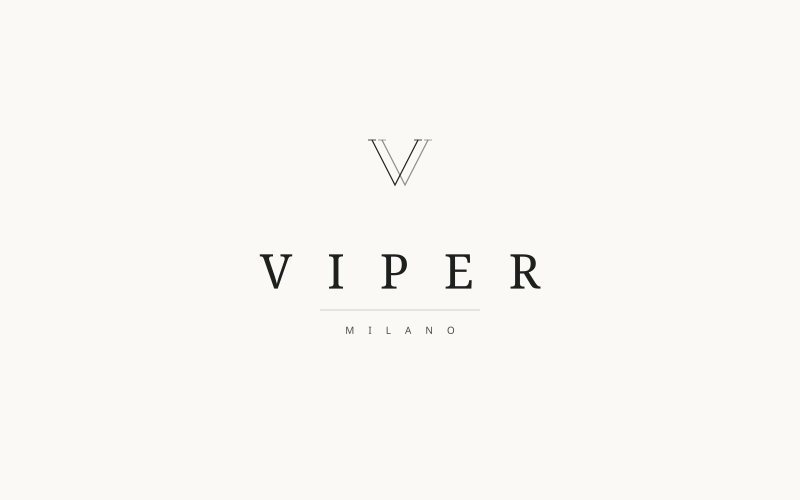

<div align="center">
  
</div>

---

<div align="center">
  
</div>

---

## Índice

* [Introdução](#-introdução)
* [Descrição do Projeto](#-descrição-do-projeto)
* [Status do Projeto](#-status-do-projeto)
* [Telas & Funcionalidades](#-telas--funcionalidades)
* [Técnicas e Tecnologias](#-técnicas-e-tecnologias)
* [Como Acessar](#-como-acessar)
* [Contato](#-contato)

---

## 📘 Introdução

**Viper Milano** é um site de e-commerce de moda feminina de alto padrão, com identidade visual inspirada nas grandes maisons italianas. Desenvolvido como projeto de estudo de front-end com foco em HTML semântico, CSS moderno e experiência de usuário premium.

---

## 📖 Descrição do Projeto

A **Viper** é uma grife feminina fictícia fundada em Milão, que comercializa roupas, acessórios, bolsas, sapatos, joias e fragrâncias. O projeto simula a interface completa de um e-commerce de luxo — desde o hero cinematográfico até o lookbook editorial e a seção de perfumes.

> *"A elegância não é uma questão de ser notada. É uma questão de ser lembrada."*
> — Giorgio Armani

---

## ✔️ Status do Projeto


---

## 🖥️ Telas & Funcionalidades

### Hero Carousel
- 3 slides com transição automática e controles manuais (setas + dots)
- Hero slide 1 com foto editorial da marca + copy italiana *"Nascida em Milão. Feita para você."*

### Identidade de Marca
- Logo **VIPER MILANO** no header com subtítulo tipográfico elegante
- Paleta de cores da grife: `#1E201E` (charcoal escuro) + `#FAF9F6` (creme off-white)
- Cursor personalizado com anel de hover em todos os elementos interativos

### Seções Editoriais
- 🎭 **Manifesto** — brand story com watermark "VIPER" em fundo creme + copy da grife
- 👤 **Quem Somos** — split layout escuro com história dos ateliês no bairro Brera, Milão
- 📸 **Lookbook SS26** — grid assimétrico editorial com legendas em italiano
- 🌹 **Perfumes — Il Profumo** — seção de fragrâncias com notas olfativas detalhadas

### Produtos
- 🆕 **Novidades** — 8 produtos com badges, cores e "Adicionar à Sacola"
- 🔥 **Mais Vendidos** — grid de 5 colunas com destaques
- 🎨 **Tendências por Estilo** — tabs interativas: Casual / Festa / Trabalho / Praia
- 👠 **Sapatos** + 👜 **Bolsas** — seções dedicadas com fundo alternado

### UX Premium
- 🔍 Barra de busca expansível no header
- 📱 Menu drawer mobile com overlay
- 💰 Mega menu em desktop com 3 colunas
- ⭐ Avaliações de clientes
- 📷 Galeria estilo Instagram feed
- 📧 Newsletter "Clube Viper" em fundo escuro com dourado
- 🎁 Barra de benefícios (frete, troca, segurança, atendimento)
- 🏷️ Marcas em destaque: Totême, Jacquemus, COS, Ganni, A.P.C., Staud
- 📣 Announcement bar com ticker animado

### Layout & Design
- 📐 Layout responsivo: desktop (1440px), tablet (1024px), mobile (768px / 520px)
- ✨ Scroll reveal (fade-up) em todos os elementos
- 🖱️ Cursor dot + ring customizado
- 🛒 Quick-add hover button nos cards de produto
- ❤️ Botão de wishlist com toggle de estado

---

## 🤖 Técnicas e Tecnologias

| Tecnologia | Uso |
|---|---|
| `HTML5` | Estrutura semântica com `header`, `nav`, `section`, `article`, `footer` + acessibilidade (`aria-label`, `lang`, `alt`) |
| `CSS3` | Custom Properties, Grid, Flexbox, `@keyframes`, `aspect-ratio`, `clamp()`, `object-fit`, media queries |
| `JavaScript` (Vanilla) | Hero slider, sticky header, mega menu, search toggle, drawer mobile, style tabs, scroll reveal, cursor personalizado |
| `Google Fonts` | Cormorant Garamond (serif editorial) + Jost (sans-serif clean) |
| `Material Symbols` | Ícones do Google (search, bag, favorite, person, etc.) |
| `SVG` | Logo vetorial VIPER MILANO em todas as variações (stacked, wordmark, monogram, combined) |

---

## 📁 Como Acessar

```bash
# Clone o repositório
git clone https://github.com/RaphaelRapisardi2003/Viper.git

# Abra o arquivo diretamente no browser
# Navegue até: Code/index.html
```

Ou acesse online clicando [aqui](https://github.com/RaphaelRapisardi2003/Viper).

---

## 📞 Contato

<div id="badges">
  <a href="https://www.linkedin.com/in/raphael-rapisardi-a55790235/">
    
  </a>
</div>

---

<div align="center">
  <sub>© 2026 Viper Milano S.r.l. — Todos os direitos reservados.</sub>
</div>
