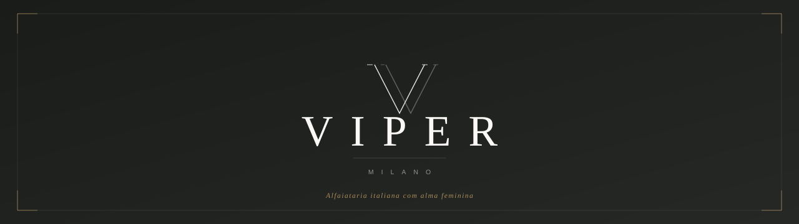
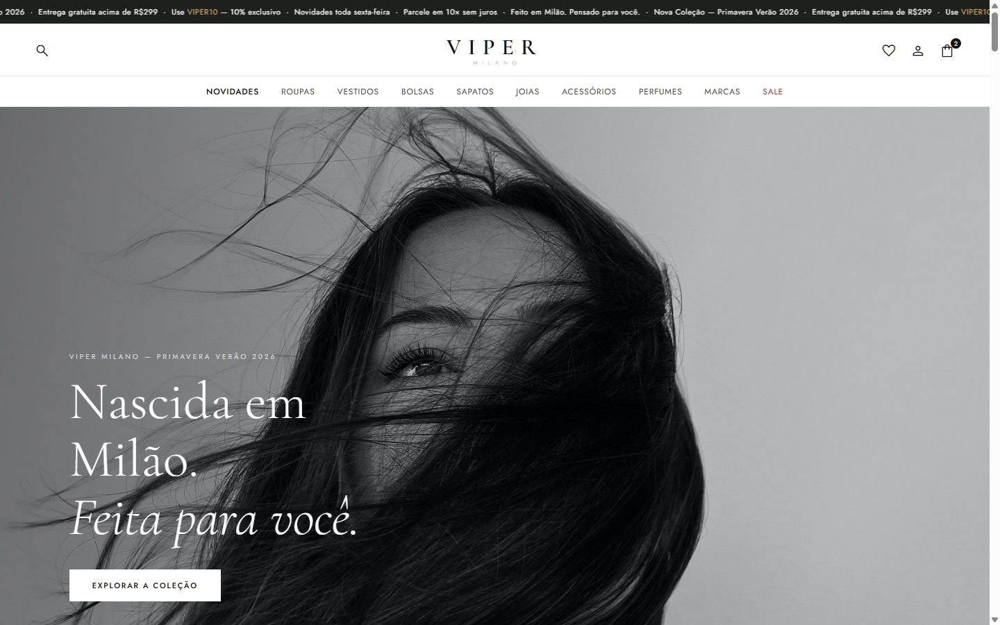
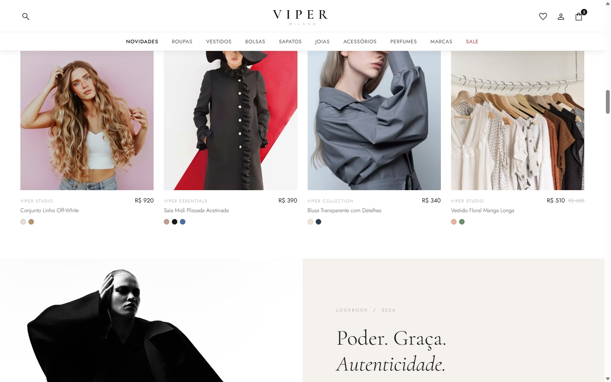
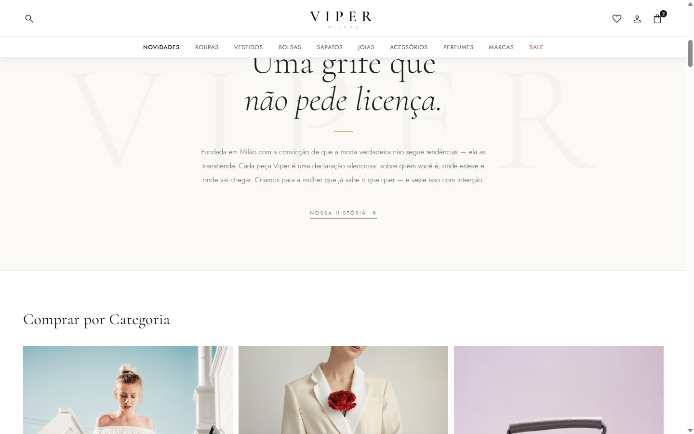
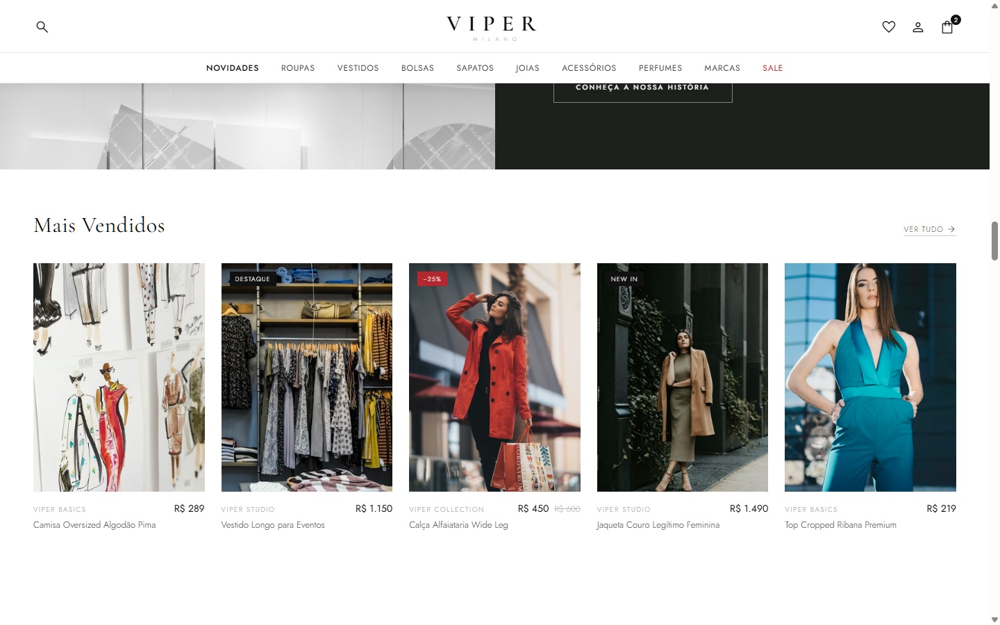
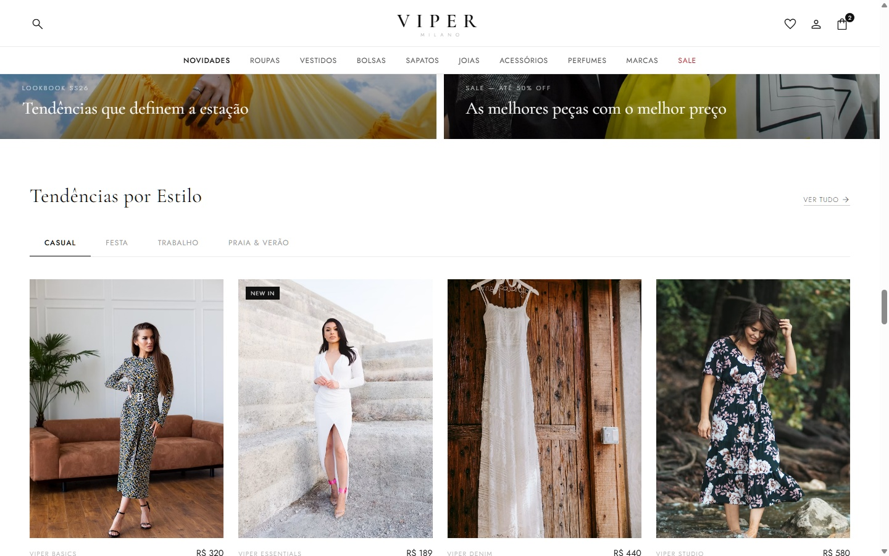

<p align="center">
  
</p>

<p align="center">
  
  &nbsp;
  
  &nbsp;
  
  &nbsp;
  
  &nbsp;
  
</p>

<p align="center">
  E-commerce de moda feminina de alto padrão, inspirado nas grandes <em>maisons</em> italianas.<br>
  Projeto front-end com identidade visual própria, lookbook editorial e experiência de usuário premium.
</p>

<br>

---

## ✦ Preview

<p align="center">
  
</p>

<br>

<table>
  <tr>
    <td align="center" width="50%">
      
      <br><sub><b>Quem Somos</b> &nbsp;·&nbsp; Split layout escuro · Brera, Milão</sub>
    </td>
    <td align="center" width="50%">
      
      <br><sub><b>Manifesto</b> &nbsp;·&nbsp; Brand story com watermark tipográfico</sub>
    </td>
  </tr>
  <tr>
    <td align="center" width="50%">
      
      <br><sub><b>Lookbook SS26</b> &nbsp;·&nbsp; Grid editorial assimétrico</sub>
    </td>
    <td align="center" width="50%">
      
      <br><sub><b>Il Profumo</b> &nbsp;·&nbsp; Notas olfativas · <em>O cheiro que te define.</em></sub>
    </td>
  </tr>
</table>

<br>

---

## ✦ Funcionalidades

<table>
  <tr>
    <td>🎭 <b>Manifesto</b></td>
    <td>Brand story com watermark "VIPER" em fundo creme e copy editorial italiana</td>
  </tr>
  <tr>
    <td>🖼️ <b>Hero Carousel</b></td>
    <td>3 slides com autoplay, setas e dots — foto editorial local como slide 1</td>
  </tr>
  <tr>
    <td>👤 <b>Quem Somos</b></td>
    <td>Split layout escuro com história dos ateliês no bairro Brera, Milão</td>
  </tr>
  <tr>
    <td>📸 <b>Lookbook SS26</b></td>
    <td>Grid assimétrico com fotos editoriais e legendas em italiano</td>
  </tr>
  <tr>
    <td>🌹 <b>Perfumes</b></td>
    <td>Seção Il Profumo com notas olfativas e layout de cena escura</td>
  </tr>
  <tr>
    <td>🛍️ <b>Produtos</b></td>
    <td>Novidades · Mais Vendidos · Tendências (tabs) · Sapatos · Bolsas · Sale</td>
  </tr>
  <tr>
    <td>🔍 <b>UX Premium</b></td>
    <td>Cursor personalizado · Mega menu · Drawer mobile · Scroll reveal · Quick-add</td>
  </tr>
  <tr>
    <td>📱 <b>Responsivo</b></td>
    <td>Desktop (1440px) · Tablet (1024px) · Mobile (768px / 520px)</td>
  </tr>
</table>

<br>

---

## ✦ Tecnologias

<p>
  
  
  
  
  
</p>

| Camada | Detalhe |
|--------|---------|
| **Next.js 15 + React 19** | App Router · Server Components nas páginas de catálogo · Client Components nos fluxos interativos |
| **TypeScript** | `strict` · Value Objects, Entities e DTOs tipados ponta a ponta |
| **Arquitetura Hexagonal + DDD** | `domain` (modelo rico + ports) → `application` (use cases) → `infrastructure` (adapters + container) → `presentation` |
| **Design Patterns** | Repository · Factory · Data Mapper / Presenter · Value Object · Use Case · Singleton (composition root) |
| **CSS3** | Custom properties (`--brand-dark` `--brand-cream` `--brand-gold`) · `aspect-ratio` · media queries |
| **Tipografia** | Cormorant Garamond (editorial serif) + Jost (clean sans) + Material Symbols |

<br>

---

## ✦ Como Executar

```bash
# Clone o repositório
git clone https://github.com/RaphaelRapisardi2003/Viper.git
cd Viper

# Instale as dependências e suba o ambiente de desenvolvimento
npm install
npm run dev   # http://localhost:3000
```

> Aplicação Next.js. Rotas: `/` (home), `/loja/[categoria]`, `/produto/[slug]` e `/carrinho`.

<br>

---

## ✦ Estrutura

```
Viper/
├── app/                          # Next.js App Router (rotas)
│   ├── page.tsx                  # Home
│   ├── loja/[categoria]/         # Listagem por coleção
│   ├── produto/[slug]/           # Detalhe do produto (PDP)
│   └── carrinho/                 # Sacola
├── components/                   # Componentes de UI
├── src/                          # Núcleo hexagonal + DDD
│   ├── domain/                   # Entities, Value Objects e Ports
│   │   ├── catalog/              #   Product · Category · ProductRepository
│   │   ├── cart/                 #   Cart · CartItem · CartRepository
│   │   └── shared/               #   Money (Value Object)
│   ├── application/              # Use Cases + DTOs + Presenters (Data Mapper)
│   │   ├── catalog/
│   │   └── cart/
│   ├── infrastructure/           # Adapters dos ports + composition root
│   │   ├── catalog/              #   Seed · ProductFactory · InMemoryProductRepository
│   │   ├── cart/                 #   LocalStorageCartRepository
│   │   └── container.ts          #   DI container (Singleton)
│   └── presentation/             # Adapters de entrada (CartProvider / useCart)
└── Pics/                         # Assets locais e logos
```

### Fluxo de dependências (Ports & Adapters)

```
 UI (app/ · components/)
        │  usa
        ▼
 application/  ── use cases ──▶ depende de ──▶ domain/ (ports: ProductRepository, CartRepository)
        ▲                                            ▲
        │ injeta                                     │ implementa
 infrastructure/container.ts ──────────────▶ infrastructure/*Repository  (adapters)
```

> A regra de dependência aponta sempre para dentro: domínio não conhece infraestrutura.
> Trocar `InMemoryProductRepository` por uma versão HTTP/Prisma não exige tocar em domínio, use cases ou UI.

<br>

---

<p align="center">
  <a href="https://www.linkedin.com/in/raphael-rapisardi-a55790235/">
    
  </a>
  &nbsp;
  <a href="https://github.com/RaphaelRapisardi2003/Viper">
    
  </a>
</p>

<p align="center">
  <sub>© 2026 Viper Milano S.r.l. &nbsp;·&nbsp; Todos os direitos reservados.</sub>
</p>
